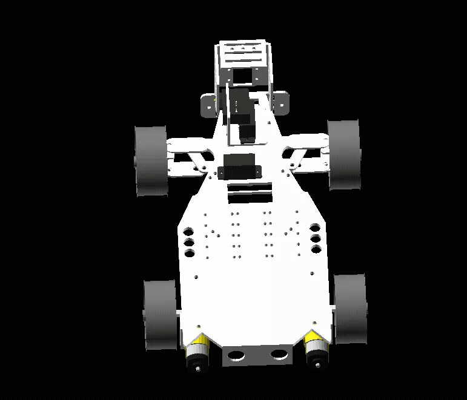

This repository contains the 3D model source files for a custom four-wheeled robot with a head mount for two Raspberry Pi Camera Module 2 sensors, with side panels for mounting to a pan-servo setup. The models are written entirely in [OpenSCAD](https://openscad.org/) and are designed to be 3D-printed.

The design focuses on a four-wheeled robot where:

- The front wheels are steered by a servo mechanism.
- The rear wheels are driven by two motors.
- a head mount design for supporting two Raspberry Pi Camera Modules.
- Multiple independent power modules can be mounted (for example, one for the Servo HAT, one for the Motor Driver HAT, and one for a UPS module that powers a Raspberry Pi 5).

> [!NOTE]
> Work in Progress:
>
> - Most of the components are ready, but the steering system is in a very raw form.
> - Additional mounting options and general model refinement

