# About

This repository contains the 3D model source files for a four-wheeled robot chassis and steering system, written entirely in [OpenSCAD](https://openscad.org/). The design supports 3D printing and does not rely on external libraries.

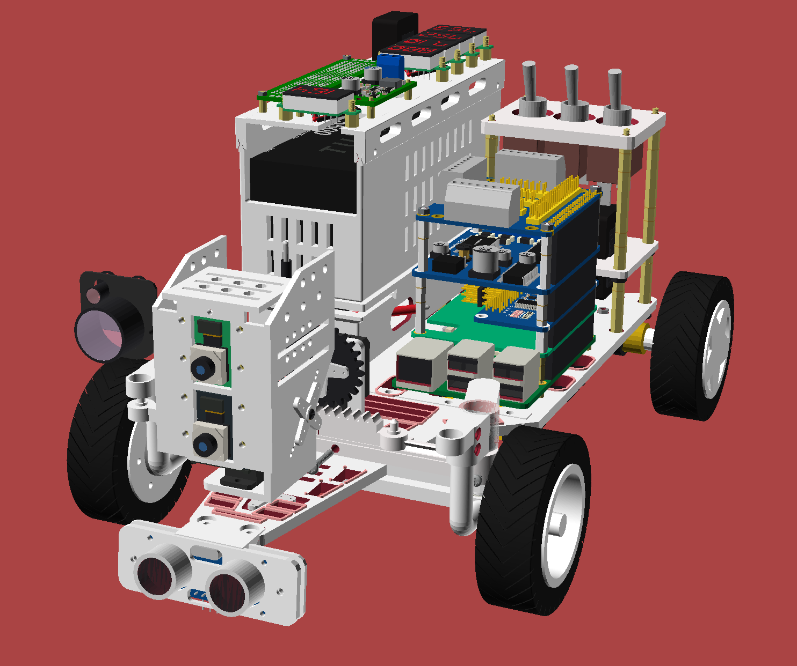
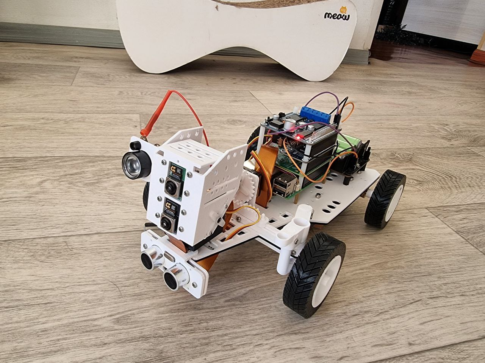

<!-- markdown-toc start - Don't edit this section. Run M-x markdown-toc-refresh-toc -->

**Table of Contents**

> - [About](#about)
>   - [Overview](#overview)
>   - [Requirements](#requirements)
>   - [Ackermann Geometry](#ackermann-geometry)
>   - [Assembly](#assembly)
>   - [Structure](#structure)
>   - [External Details](#external-details)
>     - [Bearings](#bearings)
>     - [Servos](#servos)
>     - [Raspberry Pi](#raspberry-pi)
>     - [Power Supply](#power-supply)
>       - [A Turnigy Rapid-style hardcase LiPo](#a-turnigy-rapid-style-hardcase-lipo)
>       - [UPS module S3](#ups-module-s3)
>       - [Battery holders](#battery-holders)
>     - [Motors](#motors)
>     - [Camera Module](#camera-module)
>     - [Ultrasonic](#ultrasonic)
>     - [Switch buttons and fuses](#switch-buttons-and-fuses)
>     - [IR LED](#ir-led)
>     - [Bolts and Nuts](#bolts-and-nuts)
>       - [Steering panel](#steering-panel)
>       - [Steering pinion](#steering-pinion)
>         - [For Servo gear](#for-servo-gear)
>         - [Self-tapping bolts for servo arm](#self-tapping-bolts-for-servo-arm)
>       - [Steering Knuckle](#steering-knuckle)
>       - [Raspberry Pi](#raspberry-pi-1)
>       - [Power case (default LiPo setup)](#power-case-default-lipo-setup)
>       - [Battery holder](#battery-holder)
>       - [UPS module S3](#ups-module-s3-1)
>       - [Motor brackets](#motor-brackets)
>         - [For two N20 motors](#for-two-n20-motors)
>         - [For two standard (yellow) motors](#for-two-standard-yellow-motors)
>       - [Head](#head)
>         - [For two Raspberry Pi Camera Module 3 boards](#for-two-raspberry-pi-camera-module-3-boards)
>       - [Head neck](#head-neck)
>       - [IR Case for the Infrared LED Light Board](#ir-case-for-the-infrared-led-light-board)
>       - [Ultrasonic case for HC-SR04](#ultrasonic-case-for-hc-sr04)
>       - [Wheel hubs](#wheel-hubs)

<!-- markdown-toc end -->

## Overview

The robot model is designed around the following core elements:

- **Ackermann Steering**: This design implements Ackermann steering and computes the steering radii from the robot parameters (not just by making the inner wheel turn more). The model calculates the trapezoid geometry automatically so you usually don’t need to tweak Ackermann-specific variables by hand.
- **Rear-Wheel Drive**: Two individual motors drive the rear wheels. Both standard yellow DC motors and N20-type motors are supported.
- **Modular Head Mount**: The head mount is designed to accommodate two Raspberry Pi Camera Module 3 or more sensors (e.g., day/night configuration).
- **Extendable Power Tiers**: Default power case for high-discharge LiPo packs (e.g., Turnigy Rapid 4S2P) plus battery holders plus slots for servo/motor driver HATs; Waveshare UPS S3 remains optional.
- **Raspberry Pi**: The chassis includes placements and bolt holes for the Raspberry Pi 5 and multiple 18650 battery holders.

## Requirements

Since `textmetrics` is used throughout the project, a nightly build of OpenSCAD is required. Also, be sure to enable `textmetrics` in the OpenSCAD editor via `Preferences -> Features -> textmetrics`. When using the CLI, pass `--enable=textmetrics` (e.g., `openscad --enable=textmetrics --backend=Manifold ...`).

## Ackermann Geometry

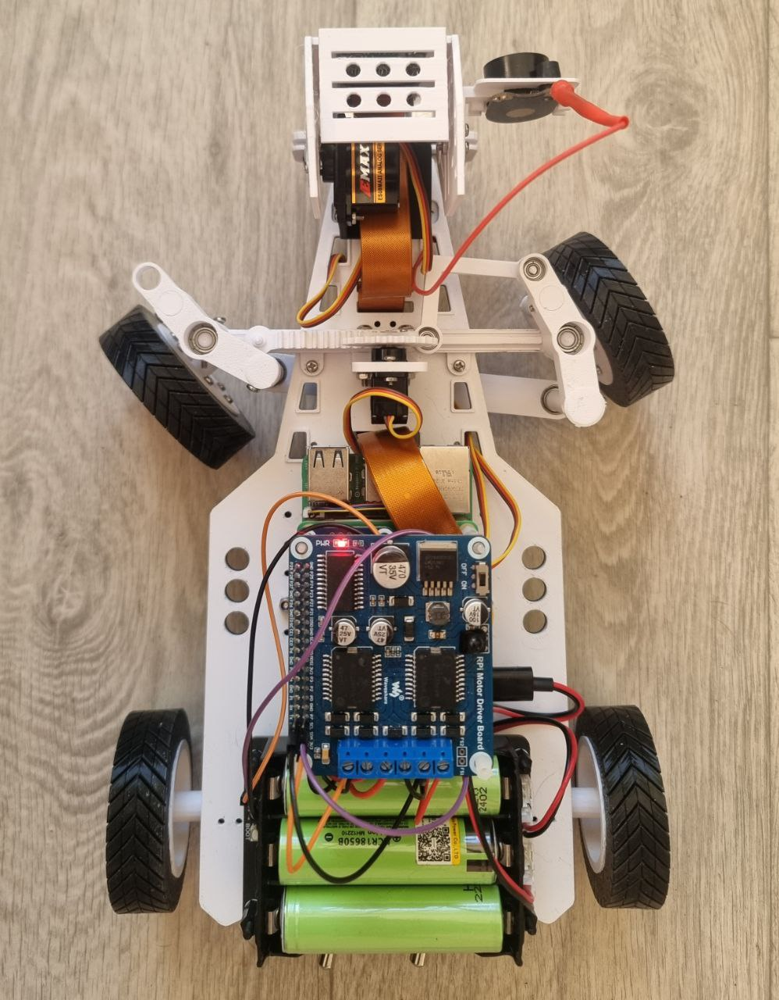

Ackermann steering is implemented with a rack-and-pinion mechanism that drives a single L-link (`rack_link`) mounted to one knuckle. That knuckle rotates when the rack moves, the opposite knuckle follows through a tie rod. The knuckles and tie rod form the Ackermann trapezoid, so the inside wheel turns more than the outside wheel.

> [!NOTE]
> Install the `rack_link` on only one side and on only one of the knuckles - it doesn't matter which. Movement of the rack will cause that "leading" knuckle to rotate. The leading knuckle is then connected to the second, "driven" knuckle via a tie rod.

Most parameters live in `scad/parameters.scad`, but the actual Ackermann geometry (angles and the required tie-rod top width) is calculated automatically from core robot dimensions such as chassis length, steering panel placement and knuckle geometry. Because of that, you will rarely need to edit Ackermann-specific variables manually - especially `steering_angle_deg`, which is derived from the layout.

## Assembly

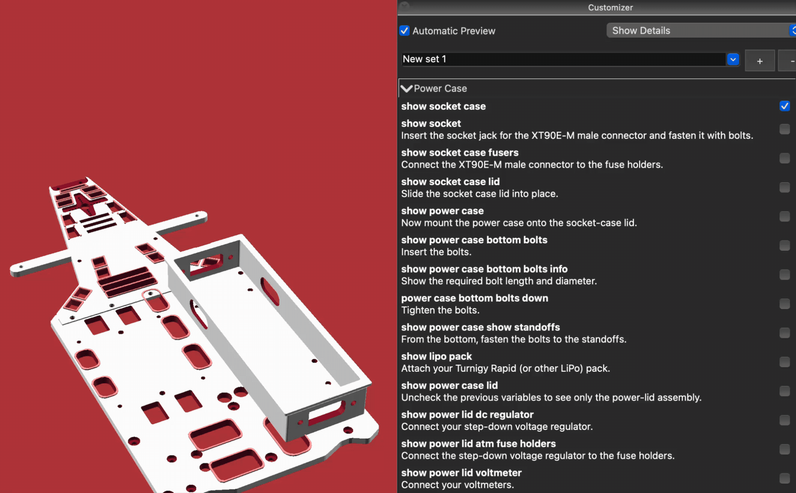

The interactive guide lives in `scad/assembly_guide.scad`. Open it in OpenSCAD and step through the boolean checkboxes in the built-in Customizer to reveal each assembly step (power case, steering, electronics, and wheels). For a static full build view, use `scad/assembly.scad`.

## Structure

The project is organized into several reusable modules under the scad/ directory:

- `parameters.scad`: Central configuration file containing physical dimensions (units are in millimeters).
- `printable.scad`: Contains all printable parts in one place, except the power case modules. You can print all parts except the tires using either PETG (recommended) or PLA. For the tires, use TPU (e.g., TPU 95A). The power case modules live in the `power/` directory.
  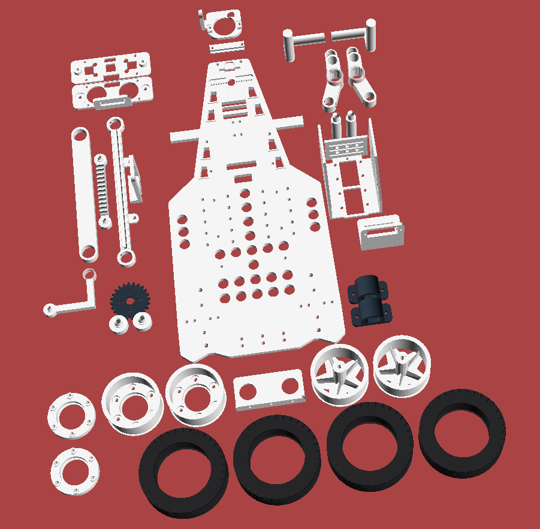
- `assembly.scad`: Fully assembled view of the robot.
  
- `assembly_guide.scad`: Interactive assembly. See [above](#assembly).
- `steering_system/`: Rack-and-pinion steering system based on Ackermann geometry.
- `power/`: Power case and related components.
- `components/chassis/`: Chassis and other components.
- `head/`: Mounting system for dual Raspberry Pi cameras.
- `motor_brackets/`: Brackets for both standard (yellow) and N20-style motors.
- `wheels/`: Components for rear and front wheels, including hubs and tires.
- `placeholders/`: Placeholder geometry for components such as the Raspberry Pi, servos, DC motors, battery holders, HATs, sensors, step-down voltage converters, INA260, etc. There’s a lot of stuff in there.

## External Details

All these details are just recommendations, you can use any other details, just don't forget to specify corresponding dimensions in `parameters.scad`.

### Bearings

- Four 685 (5x11x5) bearings: two are inserted into the steering knuckles and mounted on kingpin posts. To use different sizes, modify the variables `knuckle_bearing_outer_dia`, `knuckle_bearing_inner_dia`, and other relevant variables. The other two are inserted into the tie rod; the corresponding variables are `tie_rod_bearing_outer_dia`, `tie_rod_bearing_inner_dia`, and others.
- Two 693 (3x8x4) bearings are inserted into the rack link and into the knuckle arm that connects to the rack link. Both flanged and standard versions are supported.
- Two 608 (8x22x7) bearings are inserted into the front wheels.

### Servos

This project supports three **EMAX ES08MA II** servos by default. If using different models, update the following variables in `parameters.scad`:

- `steering_servo_slot_width` and `steering_servo_slot_height` for the steering servo
- `head_neck_pan_servo_slot_width` and `head_neck_pan_servo_slot_height` for the pan servo
- `head_neck_tilt_servo_slot_width` and `head_neck_tilt_servo_slot_height` for the tilt servo

### Raspberry Pi

Raspberry Pi 5 is supported by default. To use a different model, adjust the relevant variables prefixed with `rpi_` (e.g., `rpi_bolt_spacing`).

### Power Supply

#### A Turnigy Rapid-style hardcase LiPo

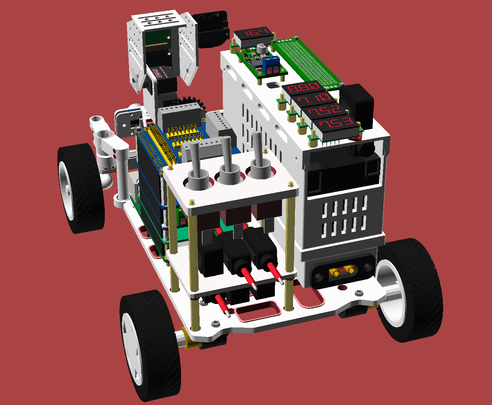

The default power source is a modular power case sized for a Turnigy Rapid-style hardcase LiPo (see the `lipo_pack_*` and `power_case_*` parameters). The lid supports an XT90E connector, blade fuses, a voltmeter, and a step-down regulator. Rails/clamps keep the pack fixed.

#### UPS module S3

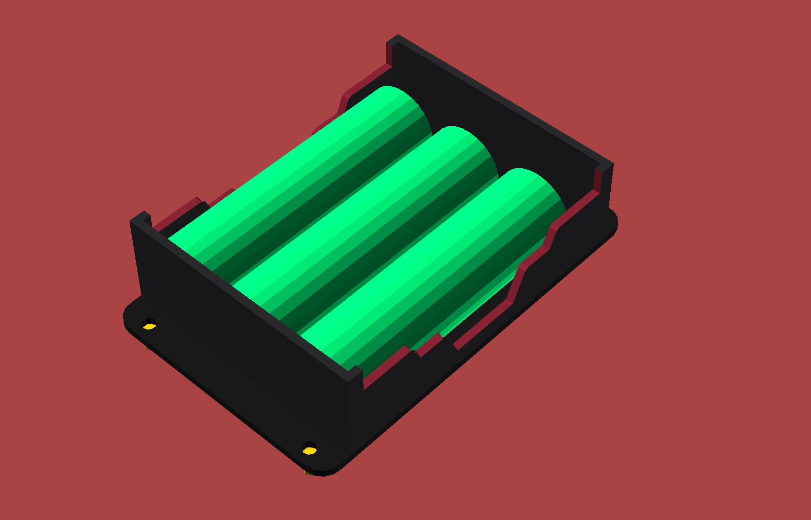

The Waveshare [UPS module S3](https://www.waveshare.com/wiki/UPS_Module_3S) is still supported, but it is no longer the default because it is not reliable enough.

If you want to use it, enable it in `parameters.scad`:

```scad
battery_ups_holes_enabled = true;
```

And in `assembly.scad`:

```scad
show_ups_hat = true;
```

You will likely also need to adjust the layout parameters for the Raspberry Pi (`rpi_chassis_y_position` and `rpi_chassis_x_position`) and perhaps disable the power case module (see the `power_*` variables).

#### Battery holders

Battery holders with different settings are supported. Variables prefixed with `battery_holder*` control the default values, so you can combine different holders and settings by editing `chassis_body_battery_holders_specs`, a property list that takes precedence over the global variables.

**By mount type**

`battery_holder_mount_type` holds the global mount type: either `under_cell` (holes under each cell intercell) or `intercell` (holes between the cells). The default is `intercell`.

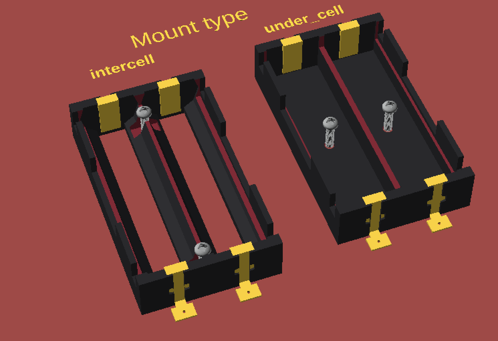

**By terminal type**

`battery_holder_terminal_type` holds the global terminal type: `solder_tab` (rectangular external tabs) or `coil_spring` (circular contact with a helical spring, positive polarity). `solder_tab` (default) will also create additional slots for the contacts in the chassis.

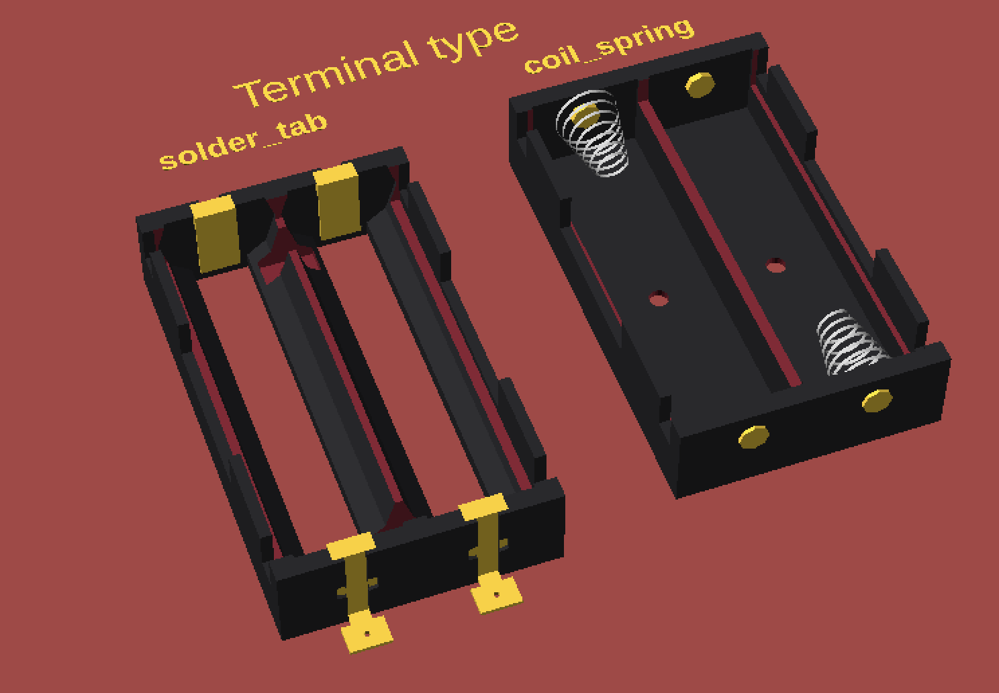

You can create as many battery holders and slots for them as you want. Here is a quick example:

```scad
chassis_body_battery_holders_specs =
  ["type", "grid",
   "size", [chassis_body_w, chassis_body_len],
   "rows",
   maybe_add_battery_holders_rows_h(
      [["cells",
        [["w", 0.5,
          "placeholder",
          ["placeholder_type", "battery_holder",
           "mount_type", battery_holder_mount_type,
           "count", 3,
           "show_battery", true,
           "terminal_type", battery_holder_terminal_type,
           "side_wall_cutout_type", battery_holder_side_wall_type]],
         ["w", 0.5,
          "placeholder",
          ["placeholder_type", "battery_holder",
           "terminal_type", "coil_spring",
           "side_wall_cutout_type", "enclosed",
           "battery_len", 70,
           "battery_dia", 21,
           "show_battery", true,
           "mount_type", "under_cell",
           "battery_color", "pink",
           "color", "black"]]]],
       ["cells",
        [["w", 0.5,
          "spin", 90,
          "placeholder",
          ["placeholder_type", "battery_holder",
           "show_battery", true,
           "count", 1,
           "mount_type", battery_holder_mount_type,
           "terminal_type", battery_holder_terminal_type,
           "side_wall_cutout_type", battery_holder_side_wall_type]]]]])];
```

Result:

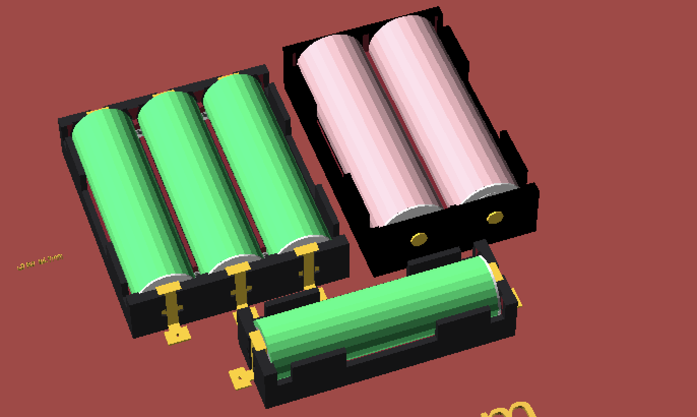

### Motors

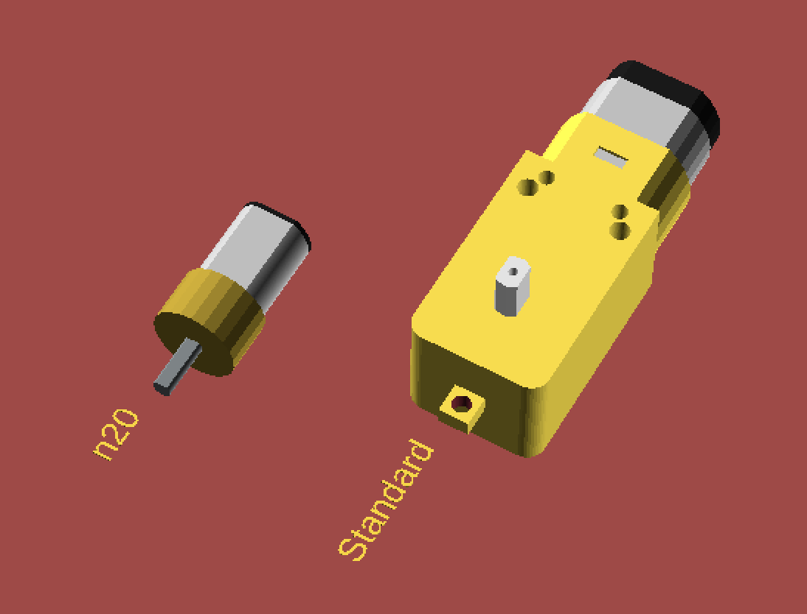

Two rear motors are supported-either standard or N20-type:

- The "n20" type refers to motors like the **GA12-N20** with a 3 mm shaft.
- The "standard" type refers to widely available yellow gear motors with a 5 mm shaft.

Rear wheel shaft size depends on the motor type. Use the variable `motor_type` in `parameters.scad` to set the proper shaft diameter.

### Camera Module

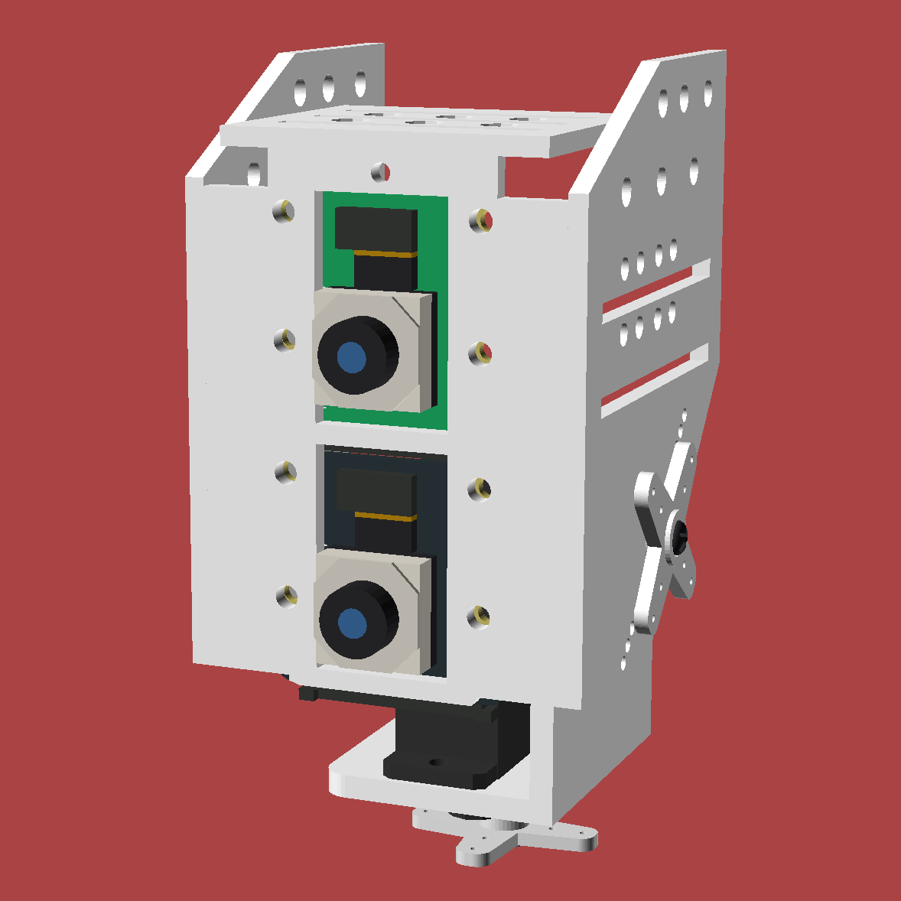

The design supports one, two or more camera modules. The default dimensions are compatible with the Raspberry Pi Camera Module 3.

### Ultrasonic

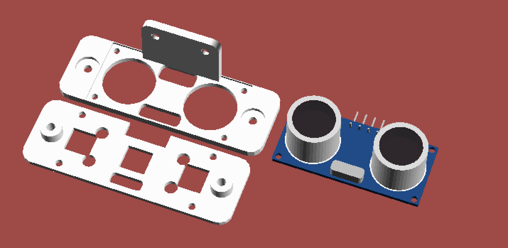

The model supports the HC-SR04 ultrasonic sensor.

### Switch buttons and fuses

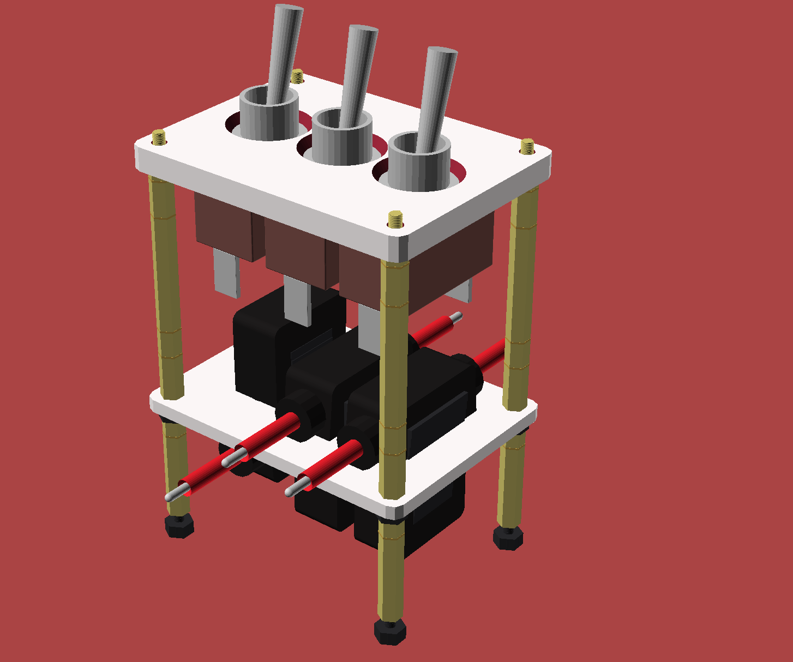

Switch buttons with a circular mounting type are supported, as well as two types of fuse holders: ATM and ATC mini.

### IR LED

The design also supports case for [IR Waveshare Infrared LED Light Board Module](https://www.waveshare.com/infrared-led-board.html).

The original LED board is incompatible with the Raspberry Camera Module 3, and the quality of Waveshare’s original camera is unsatisfactory.

Nevertheless, this LED board can be used with Camera Module 3 and other Raspberry Pi cameras. To do so, solder two wires (**GND** and **V+**) to the bolt holes on the LED board (the bolt holes serve both for mechanical attachment and for power). Then connect the positive wire to **3.3V** and the ground wire to **GND**.

### Bolts and Nuts

Since the default chassis thickness is **4 mm** (changeable via the variable `chassis_thickness`), use bolts at least **8 mm** long for fastenings that go through the chassis, depending on the nuts. I suggest using lock nuts for these bolts, but plain nuts are also acceptable.

The tables below are grouped by component. Pick only the sections relevant to your build.

Each table includes a "Variable" column that refers to a configurable variable in parameters.scad. You can change it to the bolt diameter you want to use.

#### Steering panel

| Size                     | Length (mm) | Amount | Nuts | Variable                                  |
| ------------------------ | ----------- | ------ | ---- | ----------------------------------------- |
| M2.5                     | 8           | 4      | 2    | `steering_panel_hinge_bolt_dia`           |
| M2                       | 8           | 2      | 2    | `steering_servo_bolt_dia`                 |
| M3                       | 20          | 2      | 2    | `steering_servo_mount_connector_bolt_dia` |
| M2 or M2.5 for tight fit | 10          | 4      | 4    | `steering_kingpin_post_bolt_dia`          |

#### Steering pinion

Your servo pack should already include bolts, a servo arm, and self-tapping bolts to secure the servo arm, but I'll list them here for reference as well.

##### For Servo gear

| Size | Length (mm) | Amount | Nuts | Variable                  |
| ---- | ----------- | ------ | ---- | ------------------------- |
| M2   | 4           | 1      | 0    | `steering_servo_bolt_dia` |

> [!TIP]
> The variable `steering_servo_bolt_dia` is used only in assembly views, but there are useful variables that define the diameter of the hole at the center of the pinion where you insert the servo's gearbox - `steering_pinion_center_hole_dia`. Its default size is **6.5** mm.

##### Self-tapping bolts for servo arm

Self-tapping bolts should also be included in your pack. The diameter may differ slightly, but the bolts should still fit due to the nature of self-tapping bolts.

| Size | Length (mm) | Amount    | Nuts | Variable                    |
| ---- | ----------- | --------- | ---- | --------------------------- |
| M1.5 | 4           | 2 or more | 0    | `steering_pinion_screw_dia` |

#### Steering Knuckle

| Size                     | Length (mm) | Amount            | Nuts | Variable                 |
| ------------------------ | ----------- | ----------------- | ---- | ------------------------ |
| M2.5                     | 10          | 4 (2 per knuckle) | 0    | `knuckle_shaft_bolt_dia` |
| M2 or M2.5 for tight fit | 10          | 4 (2 per knuckle) | 0    | `tie_rod_shaft_bolt_dia` |

#### Raspberry Pi

The exact bolt length depends on the standoffs you use. Since the default chassis thickness is 4 mm, you should use bolts that are at least 6 mm long.

| Size | Length (mm) | Amount | Nuts/Standoffs | Variable            |
| ---- | ----------- | ------ | -------------- | ------------------- |
| M2   | 6 or higher | 4      | 4              | `rpi_bolt_hole_dia` |

#### Power case (default LiPo setup)

| Size | Length (mm)  | Amount | Nuts/Standoffs         | Variable                     |
| ---- | ------------ | ------ | ---------------------- | ---------------------------- |
| M3   | 12 or higher | 4      | 4 standoffs or inserts | `power_case_bottom_bolt_dia` |
| M2.5 | 6 or higher  | 4      | 0                      | `power_case_rail_bolt_dia`   |

Use the M3 hardware for the case/socket stack into standoffs (default standoff body is 10 mm; adjust length to your stack height). M2.5 bolts clamp the lid rails; keep them short to avoid piercing the thin side walls.

#### Battery holder

You can attach one or two battery holders to the bottom of the chassis.

| Size | Length (mm) | Amount | Nuts | Variable                  |
| ---- | ----------- | ------ | ---- | ------------------------- |
| M2.5 | 8 or higher | 2      | 1    | `battery_holder_bolt_dia` |

#### UPS module S3

You should use either 4 or 8 M3 standoffs. If you use 8 standoffs, the nuts listed below are not needed.

| Size | Length (mm) | Amount | Nuts | Variable               |
| ---- | ----------- | ------ | ---- | ---------------------- |
| M3   | 8 or higher | 4      | 4    | `battery_ups_bolt_dia` |

#### Motor brackets

##### For two N20 motors

| Size | Length (mm) | Amount | Nuts | Variable             |
| ---- | ----------- | ------ | ---- | -------------------- |
| M2.5 | 8 or higher | 4      | 4    | `n20_motor_bolt_dia` |

##### For two standard (yellow) motors

| Size | Length (mm) | Amount | Nuts | Variable                                   |
| ---- | ----------- | ------ | ---- | ------------------------------------------ |
| M3   | 28          | 4      | 4    | `standard_motor_bracket_motor_bolt_hole`   |
| M2   | 8 or higher | 4      | 4    | `standard_motor_bracket_chassis_bolt_hole` |

#### Head

##### For two Raspberry Pi Camera Module 3 boards

| Size | Length (mm) | Amount                | Nuts | Variable               |
| ---- | ----------- | --------------------- | ---- | ---------------------- |
| M2   | 4 or higher | 8 (4 for each camera) | 8    | `head_camera_bolt_dia` |

As with the steering servo, your servo pack should already include bolts, a servo arm, and self-tapping bolts to secure the servo arm. The diameter of the hole on the head where the tilt-servo gearbox mounts is defined by `head_servo_mount_dia`.

The corresponding hole for the pan servo on the chassis is controlled by `chassis_pan_servo_slot_dia`.

#### Head neck

| Size | Length (mm) | Amount | Nuts | Variable                        |
| ---- | ----------- | ------ | ---- | ------------------------------- |
| M2   | 6 or higher | 2      | 2    | `head_neck_pan_servo_bolt_dia`  |
| M2   | 6 or higher | 2      | 2    | `head_neck_tilt_servo_bolt_dia` |

#### IR Case for the Infrared LED Light Board

| Size | Length (mm) | Amount | Nuts | Variable                |
| ---- | ----------- | ------ | ---- | ----------------------- |
| M2   | 6 or higher | 2      | 2    | `ir_case_bolt_dia`      |
| M2   | 6 or higher | 2      | 2    | `ir_case_rail_bolt_dia` |

Variable `ir_case_bolt_dia` defines the diameter of the bolt holes that attach the case to the head; `ir_case_rail_bolt_dia` defines the diameter of the rail holes that secure the IR LED to the case itself.

#### Ultrasonic case for HC-SR04

| Size | Length (mm)  | Amount | Nuts | Variable                         |
| ---- | ------------ | ------ | ---- | -------------------------------- |
| M2.5 | 10 or higher | 2 or 3 | 2    | `front_panel_connector_bolt_dia` |
| M2.5 | 10 or higher | 2      | 2    | `front_panel_bolt_dia`           |

`front_panel_connector_bolt_dia` defines the diameter of the bolt hole on the bracket that connects to the chassis, and `front_panel_bolt_dia` defines the diameter of the bolt hole on the front panel that secures the ultrasonic sensor, which is placed between the front panel and the bracket.

#### Wheel hubs

Each wheel hub requires 6 M2.5 (or M3 for a very tight fit) bolts and nuts.

| Size                     | Length (mm)  | Amount               | Nuts | Variable             |
| ------------------------ | ------------ | -------------------- | ---- | -------------------- |
| M2.5 or M3 for tight fit | 12 or higher | 12 (6 per wheel hub) | 12   | `wheel_hub_bolt_dia` |
