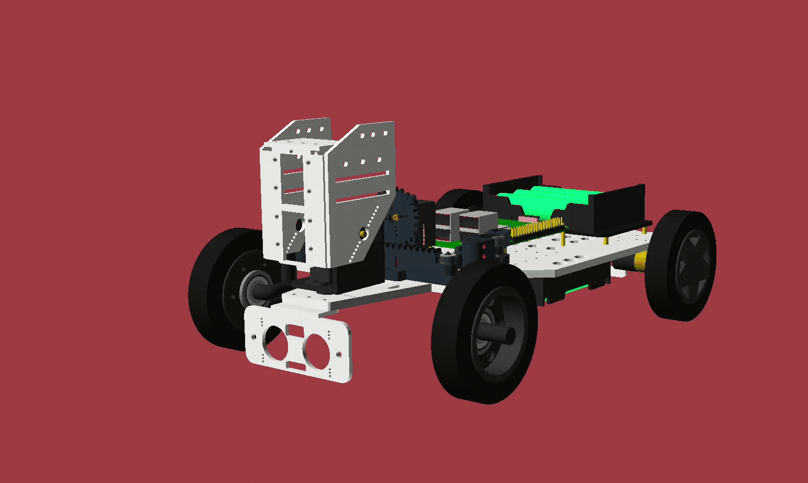
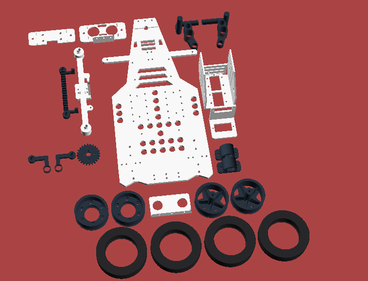
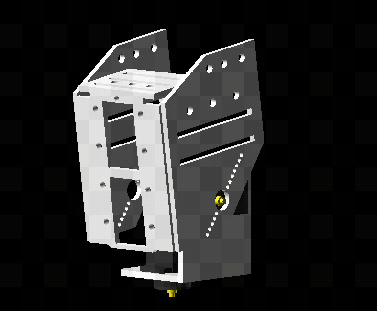

# About

This repository contains the 3D model source files for a four-wheeled robot chassis and steering system, written entirely in [OpenSCAD](https://openscad.org/). The design supports 3D printing and does not rely on external libraries.

<!-- markdown-toc start - Don't edit this section. Run M-x markdown-toc-refresh-toc -->

**Table of Contents**

> - [About](#about)
>   - [Overview](#overview)
>   - [Structure](#structure)
>   - [External Details](#external-details)
>     - [Bearings](#bearings)
>     - [Screws and Nuts](#screws-and-nuts)
>     - [Servos](#servos)
>     - [Raspberry Pi](#raspberry-pi)
>     - [Power Supply](#power-supply)
>     - [Motors](#motors)
>     - [Camera Module](#camera-module)

<!-- markdown-toc end -->

## Overview

The robot model is designed around the following core elements:

- **Ackermann Steering**: Front wheels are steered via a pinion and rack assembly driven by a standard servo.
- **Rear-Wheel Drive**: Two individual motors drive the rear wheels. Both standard yellow DC motors and N20-type motors are supported.
- **Modular Head Mount**: The head mount is designed to accommodate two Raspberry Pi Camera Module 2 sensors (e.g., day/night configuration).
- **Extendable Power Tiers**: Side and center slots allow for independent modules for power management: servo driver HAT, motor driver HAT, UPS for Raspberry Pi 5, etc.
- **Raspberry Pi**: The chassis includes placements and screw holes for the Raspberry Pi 5 and multiple 18650 battery holders.

## Structure

The project is organized into several reusable modules under the scad/ directory:

- `parameters.scad`: Central configuration file containing physical dimensions (units are in millimeters).
- `printable.scad`: Contains all printable parts in one place. Different colors indicate the recommended filament type: white for PLA, dark blue for PETG CF or PLA CF (PLA is also acceptable), and black for TPU (used only for tires).
  
- `assembly.scad`: Fully assembled view of the robot.
- `steering_system/`: Rack-and-pinion steering system based on Ackermann geometry.
- `head/`: Mounting system for dual Raspberry Pi cameras.
  
- `motor_brackets/`: Brackets for both standard (yellow) and N20-style motors.
- `wheels/`: Components for rear and front wheels, including hubs and tires.
- `placeholders/`: Placeholder geometry for components such as the Raspberry Pi, servos, DC motors, battery holders, and HATs.

## External Details

All of this details are just recommendations, you can use any other details, just don't forget to specify corresponding dimensions in `parameters.scad`.

### Bearings

- Two 685 (5x11x5) bearings, inserted into the steering knuckles. To use different sizes, modify the variable `knuckle_bearing_outer_dia` and other relevant variables.
- Two 693 (3x8x4) bearings, inserted into the bearing connectors. Both flanged and standard versions are supported.
- Two 608 (8x22x7) bearings, inserted into the front wheels.

### Screws and Nuts

- M2 screws and nuts
- M2.5 screws and nuts
- M3 screws and nuts

### Servos

This project supports three EMAX ES08MA II servos by default. If using different models, update the following variables in `parameters.scad`:

- `steering_servo_slot_width` and `steering_servo_slot_height` for the steering servo
- `head_neck_pan_servo_slot_width` and `head_neck_pan_servo_slot_height` for the pan servo
- `head_neck_tilt_servo_slot_width` and `head_neck_tilt_servo_slot_height` for the tilt servo

### Raspberry Pi

Raspberry Pi 5 is supported by default. To use a different model, adjust the relevant variables prefixed with `rpi_` (e.g., `rpi_screws_size`).

### Power Supply

You can use battery holders, a UPS module, or both. The default configuration supports two 18650 battery holders along with an S3 UPS module.

### Motors

Two rear motors are supported-either standard or N20-type:

- The “N20” type refers to motors like the GA12-N20 with a 3 mm shaft.
- The “standard” type refers to widely available yellow gear motors with a 5 mm shaft.

Rear wheel shaft size depends on the motor type. Use the variable `motor_type` in `parameters.scad` to set the proper shaft diameter.

### Camera Module

The design supports one or two camera modules. The default dimensions are compatible with the Raspberry Pi Camera Module 3.
