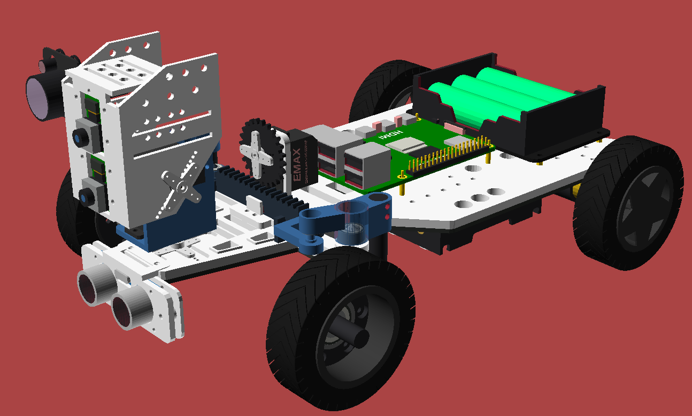
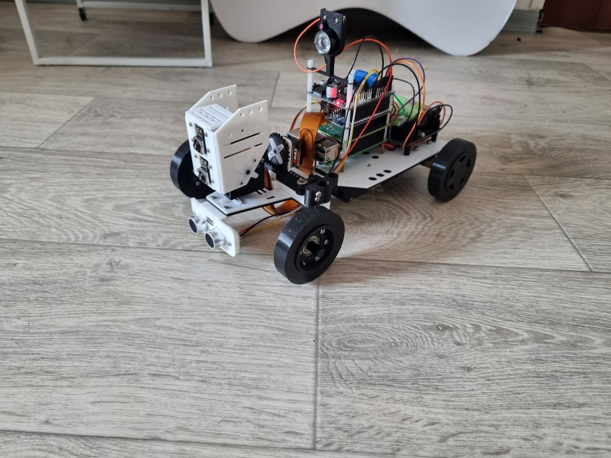
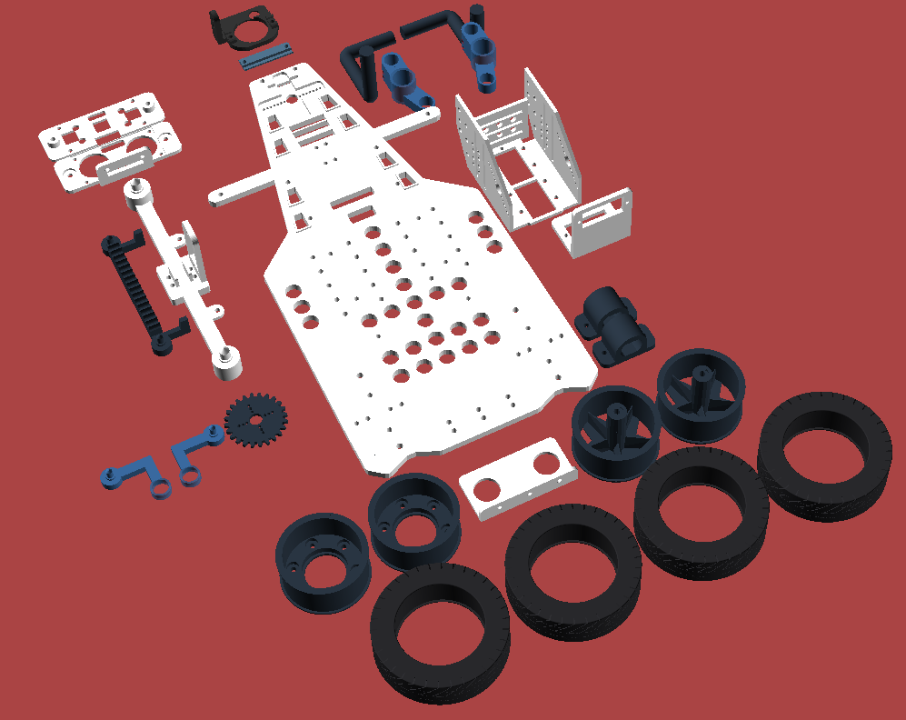
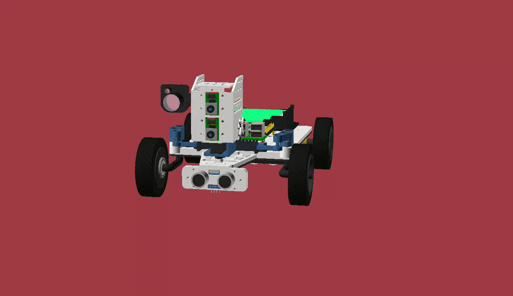

# About

This repository contains the 3D model source files for a four-wheeled robot chassis and steering system, written entirely in [OpenSCAD](https://openscad.org/). The design supports 3D printing and does not rely on external libraries.

<!-- markdown-toc start - Don't edit this section. Run M-x markdown-toc-refresh-toc -->

**Table of Contents**

> - [About](#about)
>   - [Overview](#overview)
>   - [Structure](#structure)
>   - [External Details](#external-details)
>     - [Bearings](#bearings)
>     - [Servos](#servos)
>     - [Raspberry Pi](#raspberry-pi)
>     - [Power Supply](#power-supply)
>     - [Motors](#motors)
>     - [Camera Module](#camera-module)
>     - [Ultrasonic](#ultrasonic)
>     - [IR LED](#ir-led)
>     - [Screws and Nuts](#screws-and-nuts)
>       - [Steering panel](#steering-panel)
>       - [Steering pinion](#steering-pinion)
>         - [For Servo gear](#for-servo-gear)
>         - [Self-tapping screws for servo arm](#self-tapping-screws-for-servo-arm)
>       - [Raspberry Pi](#raspberry-pi-1)
>       - [Battery holder](#battery-holder)
>       - [UPS module S3](#ups-module-s3)
>       - [Motor brackets](#motor-brackets)
>         - [For two N20 motors](#for-two-n20-motors)
>         - [For two standard (yellow) motors](#for-two-standard-yellow-motors)
>       - [Head](#head)
>         - [For two Raspberry Pi Camera Module 3 boards](#for-two-raspberry-pi-camera-module-3-boards)
>       - [Head neck](#head-neck)
>       - [IR Case for the Infrared LED Light Board](#ir-case-for-the-infrared-led-light-board)
>       - [Ultrasonic case for HC-SR04](#ultrasonic-case-for-hc-sr04)

<!-- markdown-toc end -->

## Overview

The robot model is designed around the following core elements:

- **Ackermann Steering**: Front wheels are steered via a pinion and rack assembly driven by a standard servo.
- **Rear-Wheel Drive**: Two individual motors drive the rear wheels. Both standard yellow DC motors and N20-type motors are supported.
- **Modular Head Mount**: The head mount is designed to accommodate two Raspberry Pi Camera Module 2 or more sensors (e.g., day/night configuration).
- **Extendable Power Tiers**: Side and center slots allow for independent modules for power management: servo driver HAT, motor driver HAT, UPS for Raspberry Pi 5, etc.
- **Raspberry Pi**: The chassis includes placements and screw holes for the Raspberry Pi 5 and multiple 18650 battery holders.

## Structure

The project is organized into several reusable modules under the scad/ directory:

- `parameters.scad`: Central configuration file containing physical dimensions (units are in millimeters).
- `printable.scad`: Contains all printable parts in one place. Different colors indicate the recommended filament type: white for PLA, dark blue for PETG CF or PLA CF (PLA is also acceptable), and black for TPU (used only for tires).
  
- `assembly.scad`: Fully assembled view of the robot.
  
- `steering_system/`: Rack-and-pinion steering system based on Ackermann geometry.
- `head/`: Mounting system for dual Raspberry Pi cameras.
- `motor_brackets/`: Brackets for both standard (yellow) and N20-style motors.
- `wheels/`: Components for rear and front wheels, including hubs and tires.
- `placeholders/`: Placeholder geometry for components such as the Raspberry Pi, servos, DC motors, battery holders, and HATs.

## External Details

All of this details are just recommendations, you can use any other details, just don't forget to specify corresponding dimensions in `parameters.scad`.

### Bearings

- Two 685 (_5x11x5_) bearings, inserted into the steering knuckles. To use different sizes, modify the variable `knuckle_bearing_outer_dia` and other relevant variables.
- Two 693 (_3x8x4_) bearings, inserted into the bearing connectors. Both flanged and standard versions are supported.
- Two 608 (_8x22x7_) bearings, inserted into the front wheels.

### Servos

This project supports three EMAX ES08MA II servos by default. If using different models, update the following variables in `parameters.scad`:

- `steering_servo_slot_width` and `steering_servo_slot_height` for the steering servo
- `head_neck_pan_servo_slot_width` and `head_neck_pan_servo_slot_height` for the pan servo
- `head_neck_tilt_servo_slot_width` and `head_neck_tilt_servo_slot_height` for the tilt servo

### Raspberry Pi

Raspberry Pi 5 is supported by default. To use a different model, adjust the relevant variables prefixed with `rpi_` (e.g., `rpi_screws_size`).

### Power Supply

You can use battery holders, a [UPS module S3](https://www.waveshare.com/ups-module-3s.html), or both. The default configuration supports two 18650 battery holders along with an S3 UPS module.

### Motors

Two rear motors are supported-either standard or N20-type:

- The "N20" type refers to motors like the **GA12-N20** with a 3 mm shaft.
- The "standard" type refers to widely available yellow gear motors with a 5 mm shaft.

Rear wheel shaft size depends on the motor type. Use the variable `motor_type` in `parameters.scad` to set the proper shaft diameter.

### Camera Module

The design supports one or two camera modules. The default dimensions are compatible with the Raspberry Pi Camera Module 3.

### Ultrasonic

The model supports Ultrasonic HC-SR04.

### IR LED

The design also supports case for [IR Waveshare Infrared LED Light Board Module](https://www.waveshare.com/infrared-led-board.html).

The original LED board is incompatible with the Raspberry Camera Module 3, and the quality of Waveshare’s original camera is unsatisfactory.

Nevertheless, this LED board can be used with Camera Module 3 and other Raspberry Pi cameras. To do so, solder two wires (**GND** and **V+**) to the screw holes on the LED board (the screw holes serve both for mechanical attachment and for power). Then connect the positive wire to **3.3V** and the ground wire to **GND**.

### Screws and Nuts

Since the default chassis thickness is **4 mm** (changeable via the variable `chassis_thickness`), use screws at least **8 mm** long for fastenings that go through the chassis, depending on the nuts. I suggest using lock nuts for these screws, but plain nuts are also acceptable.

The tables below are grouped by component. I haven't combined them into a single table with total quantities because totals depend on which components you use - for example, you may or may not include the UPS Module S3.

Each table includes a "Variable" column that refers to a configurable variable in parameters.scad. You can change it to the screw diameter you want to use.

#### Steering panel

| Size | Length (mm) | Amount | Nuts | Variable                         |
| ---- | ----------- | ------ | ---- | -------------------------------- |
| M2.5 | 8           | 4      | 2    | `steering_panel_hinge_screw_dia` |
| M2   | 8           | 1      | 1    | `steering_servo_screw_dia`       |
| M2   | 4           | 1      | 0    | `steering_servo_screw_dia`       |

#### Steering pinion

Your servo pack should already include screws, a servo arm, and self-tapping screws to secure the servo arm, but I'll list them here for reference as well.

##### For Servo gear

| Size | Length (mm) | Amount | Nuts | Variable                   |
| ---- | ----------- | ------ | ---- | -------------------------- |
| M2   | 4           | 1      | 0    | `steering_servo_screw_dia` |

> [!TIP]
> The variable `steering_servo_screw_dia` is used only in assembly views, but there are useful variables that define the diameter of the hole at the center of the pinion where you insert the servo's gearbox - `steering_pinion_center_hole_dia`. Its default size is **6.5** mm.

##### Self-tapping screws for servo arm

Self-tapping screws should also be included in your pack. The diameter may differ slightly, but the screws should still fit due to the nature of self-tapping screws.

| Size | Length (mm) | Amount    | Nuts | Variable                    |
| ---- | ----------- | --------- | ---- | --------------------------- |
| M1.5 | 4           | 2 or more | 0    | `steering_pinion_screw_dia` |

#### Raspberry Pi

The exact screw length depends on the standoffs you use. Since the default chassis thickness is 4 mm, you should use screws that are at least 6 mm long.

| Size | Length (mm) | Amount | Nuts/Standoffs | Variable             |
| ---- | ----------- | ------ | -------------- | -------------------- |
| M2   | 6 or higher | 4      | 4              | `rpi_screw_hole_dia` |

#### Battery holder

You can attach one or two battery holders to the bottom of the chassis.

| Size | Length (mm) | Amount | Nuts | Variable                        |
| ---- | ----------- | ------ | ---- | ------------------------------- |
| M2.5 | 8 or higher | 2      | 1    | `battery_holder_screw_hole_dia` |

#### UPS module S3

You should use either 4 or 8 M3 standoffs. If you use 8 standoffs, the nuts listed below are not needed.

| Size | Length (mm) | Amount | Nuts | Variable                     |
| ---- | ----------- | ------ | ---- | ---------------------------- |
| M3   | 8 or higher | 4      | 4    | `battery_ups_screw_hole_dia` |

#### Motor brackets

##### For two N20 motors

| Size | Length (mm) | Amount | Nuts | Variable               |
| ---- | ----------- | ------ | ---- | ---------------------- |
| M2.5 | 8 or higher | 4      | 4    | `n20_motor_screws_dia` |

##### For two standard (yellow) motors

| Size | Length (mm) | Amount | Nuts | Variable                                    |
| ---- | ----------- | ------ | ---- | ------------------------------------------- |
| M3   | 28          | 4      | 4    | `standard_motor_bracket_motor_screw_hole`   |
| M2   | 8 or higher | 4      | 4    | `standard_motor_bracket_chassis_screw_hole` |

#### Head

##### For two Raspberry Pi Camera Module 3 boards

| Size | Length (mm) | Amount                | Nuts | Variable                |
| ---- | ----------- | --------------------- | ---- | ----------------------- |
| M2   | 4 or higher | 8 (4 for each camera) | 8    | `head_camera_screw_dia` |

As with the steering servo, your servo pack should already include screws, a servo arm, and self-tapping screws to secure the servo arm. The diameter of the hole on the head where the tilt-servo gearbox mounts is defined by `head_servo_mount_dia`.

The corresponding hole for the pan servo on the chassis is controlled by `chassis_pan_servo_slot_dia`.

#### Head neck

| Size | Length (mm) | Amount | Nuts | Variable                         |
| ---- | ----------- | ------ | ---- | -------------------------------- |
| M2   | 6 or higher | 2      | 2    | `head_neck_pan_servo_screw_dia`  |
| M2   | 6 or higher | 2      | 2    | `head_neck_tilt_servo_screw_dia` |

#### IR Case for the Infrared LED Light Board

| Size | Length (mm) | Amount | Nuts | Variable                |
| ---- | ----------- | ------ | ---- | ----------------------- |
| M2   | 6 or higher | 2      | 2    | `ir_case_screw_dia`     |
| M2   | 6 or higher | 2      | 2    | `ir_case_rail_hole_dia` |

Variable `ir_case_screw_dia` defines the diameter of the screw holes that attach the case to the head; `ir_case_rail_hole_dia` defines the diameter of the rail holes that secure the IR LED to the case itself.

#### Ultrasonic case for HC-SR04

| Size | Length (mm)  | Amount | Nuts | Variable                          |
| ---- | ------------ | ------ | ---- | --------------------------------- |
| M2.5 | 10 or higher | 2 or 3 | 2    | `front_panel_connector_screw_dia` |
| M2.5 | 10 or higher | 2      | 2    | `front_panel_screw_dia`           |

`front_panel_connector_screw_dia` defines the diameter of the screw hole on the bracket that connects to the chassis, and `front_panel_screw_dia` defines the diameter of the screw hole on the front panel that secures the ultrasonic sensor, which is placed between the front panel and the bracket.
